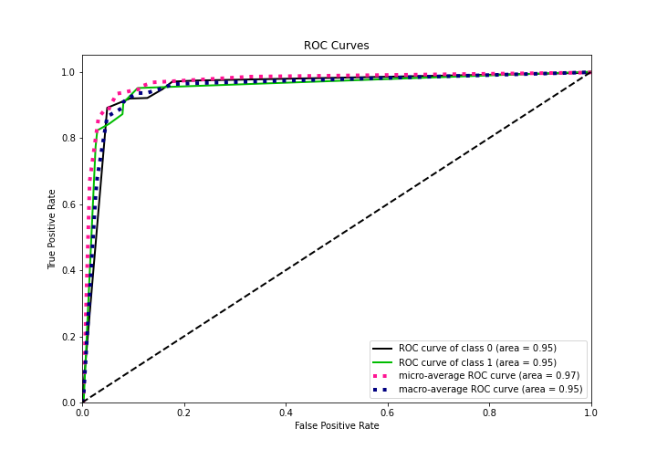

# Summary of 2_DecisionTree

[<< Go back](../README.md)

## Decision Tree
- **n_jobs**: -1
- **criterion**: gini
- **max_depth**: 3
- **explain_level**: 2

## Validation
 - **validation_type**: split
 - **train_ratio**: 0.75
 - **shuffle**: True
 - **stratify**: True

## Optimized metric
logloss

## Training time

13.1 seconds

## Metric details
|           |    score |   threshold |
|:----------|---------:|------------:|
| logloss   | 0.240871 | nan         |
| auc       | 0.950177 | nan         |
| f1        | 0.860825 |   0.570047  |
| accuracy  | 0.933168 |   0.570047  |
| precision | 0.907514 |   0.896728  |
| recall    | 1        |   0.0144355 |
| mcc       | 0.8185   |   0.570047  |

## Confusion matrix (at threshold=0.570047)
|              |   Predicted as 0 |   Predicted as 1 |
|:-------------|-----------------:|-----------------:|
| Labeled as 0 |              587 |               18 |
| Labeled as 1 |               36 |              167 |

## Learning curves

## Decision Tree 

### Tree #1

### Rules

if (chlorides scaled <= 0.091) and (volatile acidity scaled <= 0.257) and (fixed acidity scaled <= 0.401) then class: 0 (proba: 98.4%) | based on 1,621 samples

if (chlorides scaled > 0.091) and (sulphates scaled > 0.138) and (density scaled > 0.128) then class: 1 (proba: 94.5%) | based on 527 samples

if (chlorides scaled <= 0.091) and (volatile acidity scaled > 0.257) and (chlorides scaled <= 0.076) then class: 0 (proba: 80.49%) | based on 82 samples

if (chlorides scaled <= 0.091) and (volatile acidity scaled <= 0.257) and (fixed acidity scaled > 0.401) then class: 0 (proba: 66.67%) | based on 66 samples

if (chlorides scaled > 0.091) and (sulphates scaled <= 0.138) and (fixed acidity scaled <= 0.331) then class: 0 (proba: 91.67%) | based on 60 samples

if (chlorides scaled <= 0.091) and (volatile acidity scaled > 0.257) and (chlorides scaled > 0.076) then class: 1 (proba: 84.85%) | based on 33 samples

if (chlorides scaled > 0.091) and (sulphates scaled > 0.138) and (density scaled <= 0.128) then class: 0 (proba: 88.0%) | based on 25 samples

if (chlorides scaled > 0.091) and (sulphates scaled <= 0.138) and (fixed acidity scaled > 0.331) then class: 1 (proba: 100.0%) | based on 9 samples

## Permutation-based Importance

## Confusion Matrix

## Normalized Confusion Matrix

## ROC Curve

## Kolmogorov-Smirnov Statistic

## Precision-Recall Curve

## Calibration Curve

## Cumulative Gains Curve

## Lift Curve

## SHAP Importance

## SHAP Dependence plots

### Dependence (Fold 1)

## SHAP Decision plots

### Top-10 Worst decisions for class 0 (Fold 1)

### Top-10 Best decisions for class 0 (Fold 1)

### Top-10 Worst decisions for class 1 (Fold 1)

### Top-10 Best decisions for class 1 (Fold 1)

[<< Go back](../README.md)
