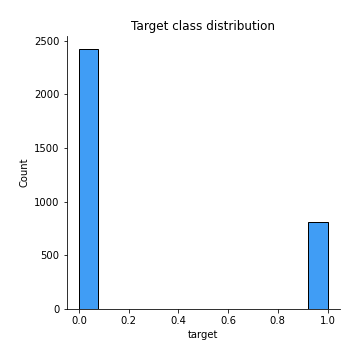
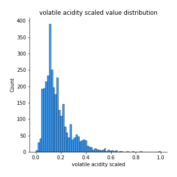
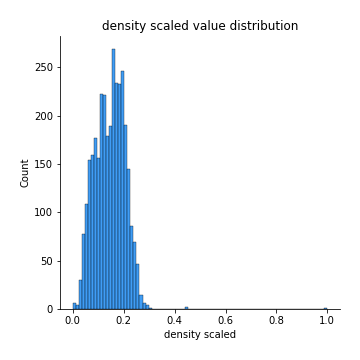
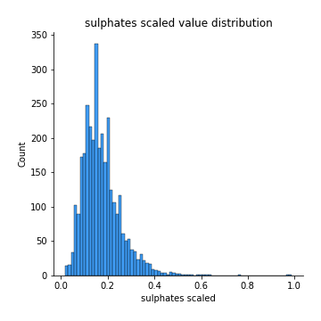
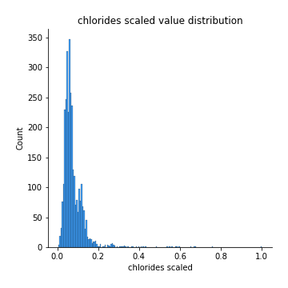
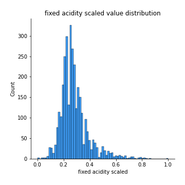

# Exploratory Data Analysis

[<< Go back](../README.md)
## Feature : target
- **Feature type** : discrete
- **Missing** : 0.0%
- **Unique** : 2
- **Count** :3231.0
- **Mean** :0.25069637883008355
- **Std** :0.4334810972298794
- **Min** :0.0
- **25%th Percentile** : 0.0
- **50%th Percentile** : 0.0
- **75%th Percentile** : 1.0
- **Max** :1.0

## Feature : volatile acidity scaled
- **Feature type** : continous
- **Missing** : 0.0%
- **Unique** : 169
- **Count** :3231.0
- **Mean** :0.17248426699680178
- **Std** :0.11003813589053187
- **Min** :0.0
- **25%th Percentile** : 0.09999999999999999
- **50%th Percentile** : 0.13999999999999996
- **75%th Percentile** : 0.21333333333333332
- **Max** :0.9999999999999999

## Feature : density scaled
- **Feature type** : continous
- **Missing** : 0.0%
- **Unique** : 811
- **Count** :3231.0
- **Mean** :0.14655761848255647
- **Std** :0.05911776201917799
- **Min** :0.0
- **25%th Percentile** : 0.10198573356468188
- **50%th Percentile** : 0.15018315018314965
- **75%th Percentile** : 0.19047619047619335
- **Max** :1.0

## Feature : sulphates scaled
- **Feature type** : continous
- **Missing** : 0.0%
- **Unique** : 97
- **Count** :3231.0
- **Mean** :0.17454504988541542
- **Std** :0.083262121266772
- **Min** :0.016853932584269662
- **25%th Percentile** : 0.11797752808988764
- **50%th Percentile** : 0.16292134831460675
- **75%th Percentile** : 0.2134831460674157
- **Max** :0.9887640449438203

## Feature : chlorides scaled
- **Feature type** : continous
- **Missing** : 0.0%
- **Unique** : 172
- **Count** :3231.0
- **Mean** :0.07786898309668237
- **Std** :0.05782042328705369
- **Min** :0.0049833887043189366
- **25%th Percentile** : 0.04817275747508305
- **50%th Percentile** : 0.06478405315614617
- **75%th Percentile** : 0.09136212624584718
- **Max** :0.9999999999999999

## Feature : fixed acidity scaled
- **Feature type** : continous
- **Missing** : 0.0%
- **Unique** : 98
- **Count** :3231.0
- **Mean** :0.28248169207905804
- **Std** :0.10711304146134075
- **Min** :0.0
- **25%th Percentile** : 0.2148760330578512
- **50%th Percentile** : 0.2644628099173554
- **75%th Percentile** : 0.3223140495867768
- **Max** :0.9999999999999999

[<< Go back](../README.md)
