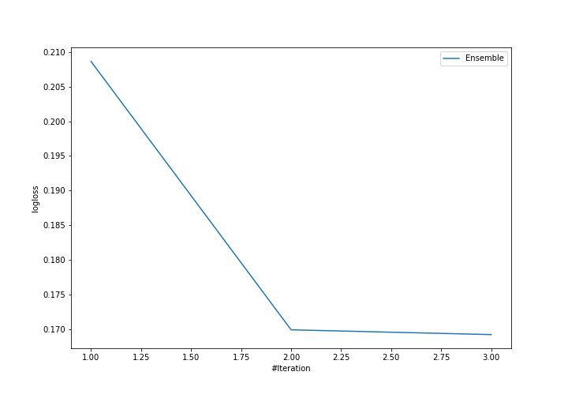
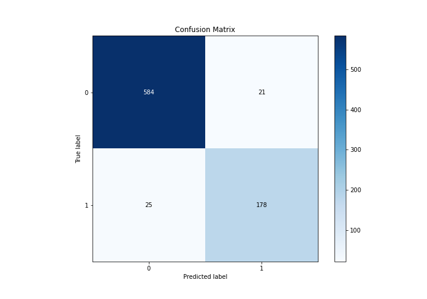
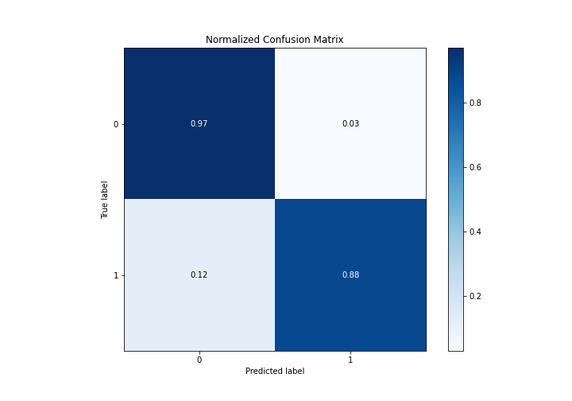
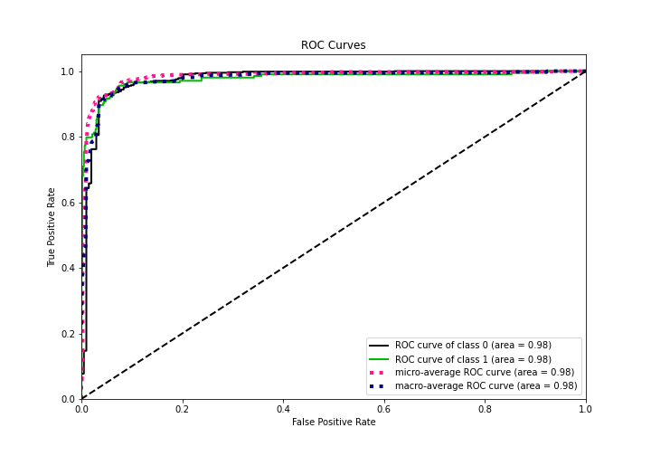
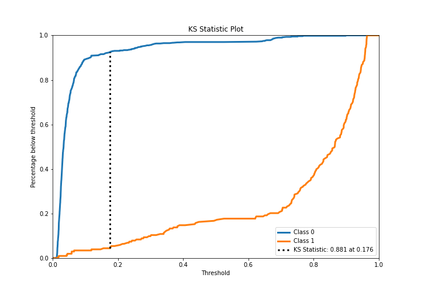
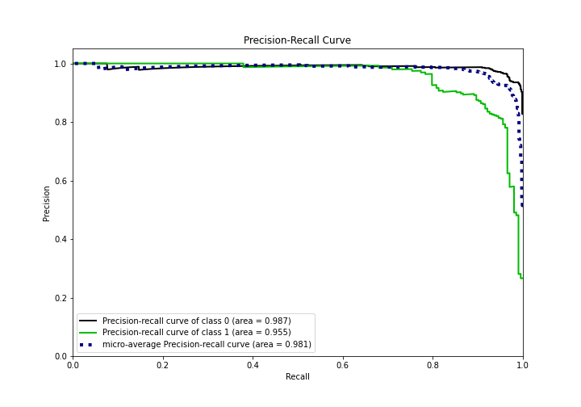
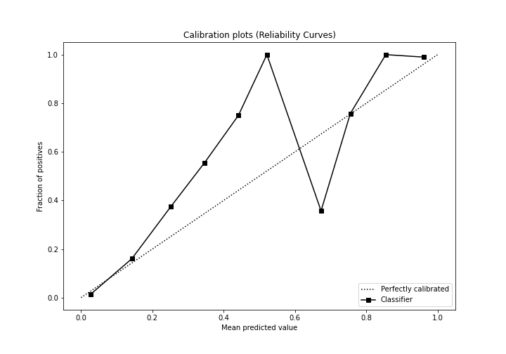
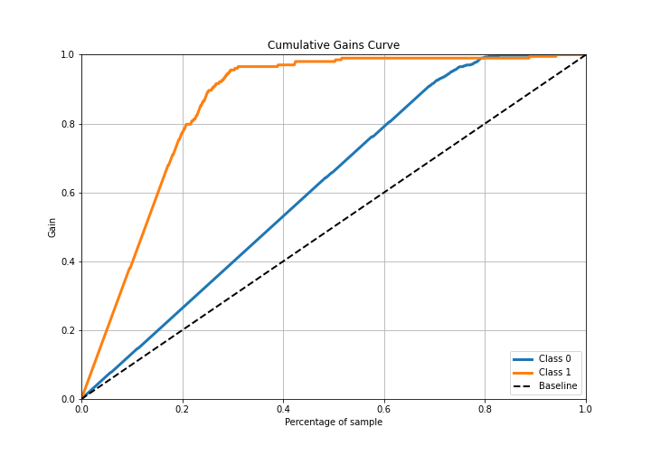
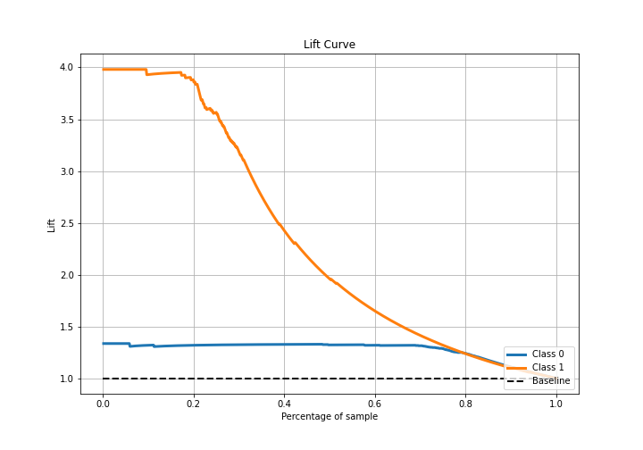

# Summary of Ensemble

[<< Go back](../README.md)

## Ensemble structure
| Model          |   Weight |
|:---------------|---------:|
| 2_DecisionTree |        2 |
| 3_Linear       |        1 |

## Metric details
|           |    score |   threshold |
|:----------|---------:|------------:|
| logloss   | 0.169179 | nan         |
| auc       | 0.975935 | nan         |
| f1        | 0.885572 |   0.351246  |
| accuracy  | 0.943069 |   0.351246  |
| precision | 1        |   0.931449  |
| recall    | 1        |   0.0109403 |
| mcc       | 0.84776  |   0.351246  |

## Confusion matrix (at threshold=0.351246)
|              |   Predicted as 0 |   Predicted as 1 |
|:-------------|-----------------:|-----------------:|
| Labeled as 0 |              584 |               21 |
| Labeled as 1 |               25 |              178 |

## Learning curves

## Confusion Matrix

## Normalized Confusion Matrix

## ROC Curve

## Kolmogorov-Smirnov Statistic

## Precision-Recall Curve

## Calibration Curve

## Cumulative Gains Curve

## Lift Curve

[<< Go back](../README.md)
